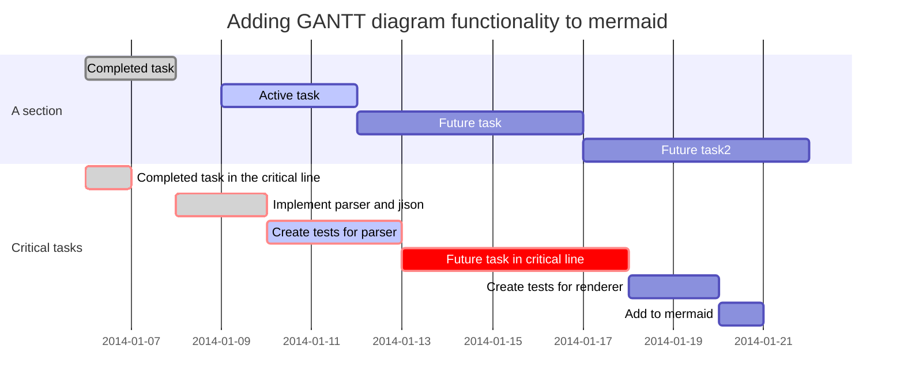

tags: #multimarkdown #markdown
category: template durable dynamic

# Syntax for Docs - REMOVE FROM LIVE DOCS

This is a template document giving an overview of the syntax that can be used throughout these docs.

**Table of Contents**

{{TOC}}

## AutoStructify

* [Link to Some File](somefile.md)
* [Link to Installation File](installation.md)

## Embed reStructuredText

```eval_rst
.. todo::

    - nice!
```

## Code URL Resolver

I can link to my [setup.py file on github](../../../setup.py)

## Code and Syntax Highlighting

Inline `code` has `back-ticks around` it.
    
```javascript
var s = "JavaScript syntax highlighting";
alert(s);
```
 
```python
s = "Python syntax highlighting"
print s
myString = """Lorem ipsum dolor sit amet, consectetur adipisicing elit, sed do eiusmod tempor incididunt ut labore et dolore magna aliqua. Ut enim ad minim veniam, quis nostrud exercitation ullamco laboris nisi ut aliquip ex ea commodo consequat. Duis aute irure dolor in reprehenderit in voluptate velit esse cillum dolore eu fugiat nulla pariatur. Excepteur sint occaecat cupidatat non proident, sunt in culpa qui officia deserunt mollit anim id est laborum."""
```
     
```
No language indicated, so no syntax highlighting. 
But let's throw in a <b>tag</b>.
```
    
## Mermaid



## Flowchart

```flow
s=>start: start
e=>end: end
o=>operation: operation
sr=>subroutine: subroutine
c=>condition: condition
i=>inputoutput: inputoutput
p=>parallel: parallel

s->o->c
c(yes)->i->e
c(no)->p
p(path1, bottom)->sr(right)->o
p(path2, top)->o
```

## Tables
    
Colons can be used to align columns.

| Tables        | Are           | Cool  |
| ------------- |:-------------:| -----:|
| col 3 is      | right-aligned | $1600 |
| col 2 is      | centered      |   $12 |
| zebra stripes | are neat      |    $1 |

## Definitions

term
: definition

## Transclusion

If MMD transclusion is working you will see usage instructions here:

{{usage.md}}

If iA transclusion is working you will see a unicorn here:

/multimarkdown_transclusion_test_20190121111324.md

## Linking to an Adjacent File

[Here is another file in the same directory](./multimarkdown_transclusion_test_20190121111324.md)

## Math

A formula, ${e}^{i\pi }+1=0$, inside a paragraph.

$${e}^{i\pi }+1=0$$

## Super/Sub Scripts

m^2

x^2,y^

x~z

C~6~H~12~O~6


## Citations

Cite a source.[p. 42][#20200121]

[#20200121]: John Doe. *A Totally Fake Book*. Vanity Press, 2006.

Black (2015)[#Black:2015tz]

[#Black:2015tz]: A Bryden Black 2015, *The Lion, the Dove, & the Lamb*, Wipf and Stock Publishers

## CriticMarkup

This {++is ++}a test.

This is {--is --}a test.

This {~~isn't~>is~~} a test.

This is a {==test==}.

This is a test.{>>What is it a test of?<<}


## Paragraphs

Lorem ipsum dolor sit amet, consectetur adipisicing elit, sed do eiusmod tempor incididunt ut labore et dolore magna aliqua. Ut enim ad minim veniam, quis nostrud exercitation ullamco laboris nisi ut aliquip ex ea commodo consequat. Duis aute irure dolor in reprehenderit in voluptate velit esse cillum dolore eu fugiat nulla pariatur. Excepteur sint occaecat cupidatat non proident, sunt in culpa qui officia deserunt mollit anim id est laborum.

Sed ut perspiciatis unde omnis iste natus error sit voluptatem accusantium doloremque laudantium, totam rem aperiam, eaque ipsa quae ab illo inventore veritatis et quasi architecto beatae vitae dicta sunt explicabo. Nemo enim ipsam voluptatem quia voluptas sit aspernatur aut odit aut fugit, sed quia consequuntur magni dolores eos qui ratione voluptatem sequi nesciunt. Neque porro quisquam est, qui dolorem ipsum quia dolor sit amet, consectetur, adipisci velit, sed quia non numquam eius modi tempora incidunt ut labore et dolore magnam aliquam quaerat voluptatem. Ut enim ad minima veniam, quis nostrum exercitationem ullam corporis suscipit laboriosam, nisi ut aliquid ex ea commodi consequatur? Quis autem vel eum iure reprehenderit qui in ea voluptate velit esse quam nihil molestiae consequatur, vel illum qui dolorem eum fugiat quo voluptas nulla pariatur?

At vero eos et accusamus et iusto odio dignissimos ducimus qui blanditiis praesentium voluptatum deleniti atque corrupti quos dolores et quas molestias excepturi sint occaecati cupiditate non provident, similique sunt in culpa qui officia deserunt mollitia animi, id est laborum et dolorum fuga. Et harum quidem rerum facilis est et expedita distinctio. Nam libero tempore, cum soluta nobis est eligendi optio cumque nihil impedit quo minus id quod maxime placeat facere possimus, omnis voluptas assumenda est, omnis dolor repellendus. Temporibus autem quibusdam et aut officiis debitis aut rerum necessitatibus saepe eveniet ut et voluptates repudiandae sint et molestiae non recusandae. Itaque earum rerum hic tenetur a sapiente delectus, ut aut reiciendis voluptatibus maiores alias consequatur aut perferendis doloribus asperiores repellat.


## Cross References

### Intro  

Some text

### Conclusion [fin]

Link to [Intro].

Link to the [end][fin].

Link to [Task Lists](#task-lists)

## Task Lists

- [x] Completed task item
- [ ] Unfinished task item

## Footnote

Here's a sentence with a footnote[^1] in the middle of it!

## Headers
    
    # H1
    ## H2
    ### H3
    #### H4
    ##### H5
    ###### H6

## Emphasis
    
Emphasis, aka italics, with *asterisks* or _underscores_.     
Strong emphasis, aka bold, with **asterisks** or __underscores__.      
Strikethrough uses two tildes. ~~Scratch this.~~     

Add highlight uses two equals ==highlight==     


## Lists


1. First ordered list item
2. Another item
    * Unordered sub-list. 
1. Actual numbers don't matter, just that it's a number
    1. Ordered sub-list
4. And another item.

    You can have properly indented paragraphs within list items.   

and unordered lists:

* Unordered list can use asterisks
- Or minuses
+ Or pluses
    
## Links

[I'm an inline-style link](https://www.google.com)
    
[I'm an inline-style link with title](https://www.google.com "Google's Homepage")
    
[I'm a reference-style link][Arbitrary case-insensitive reference text]
    
[I'm a relative reference to a repository file](../blob/master/LICENSE)
    
[You can use numbers for reference-style link definitions][1]
    
Or leave it empty and use the [link text itself].
    
URLs and URLs in angle brackets will automatically get turned into links. 
http://www.example.com or <http://www.example.com> and sometimes example.com (but not on Github, for example).
    
Some text to show that the reference links can follow later.

[arbitrary case-insensitive reference text]: https://www.mozilla.org
[1]: http://slashdot.org
[link text itself]: http://www.reddit.com

## Images
    
Here's our logo (hover to see the title text):

Inline-style: 


Reference-style: 
![alt text][logo]

[logo]: https://github.com/adam-p/markdown-here/raw/master/src/common/images/icon48.png "Logo Title Text 2"

## Blockquotes
    
> Blockquotes are very handy in email to emulate reply text.
> This line is part of the same quote.

Quote break.

> This is a very long line that will still be quoted properly when it wraps. Oh boy let's keep writing to make sure this is long enough to actually wrap for everyone. Oh, you can *put* **Markdown** into a blockquote. 

## Inline HTML

You can also use raw HTML in your Markdown, and it'll mostly work pretty well.
    
<dl>
  <dt>Definition list</dt>
  <dd>Is something people use sometimes.</dd>

  <dt>Markdown in HTML</dt>
  <dd>Does *not* work **very** well. Use HTML <em>tags</em>.</dd>
</dl>

## Abbreviations

The HTML specification is maintained by the W3C.

*[HTML]: Hyper Text Markup Language
*[W3C]:  World Wide Web Consortium
    

## Horizontal Rule
    
Three or more...

---

Hyphens

[^1]: This is the footnote.

